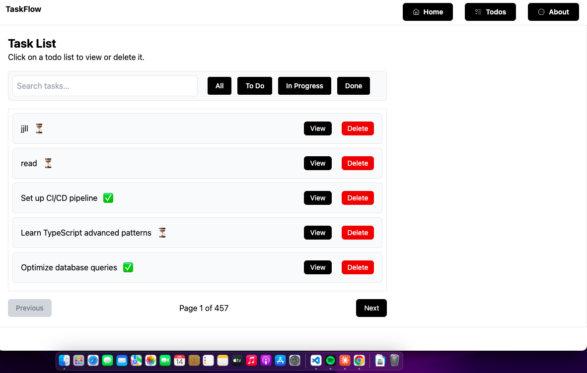
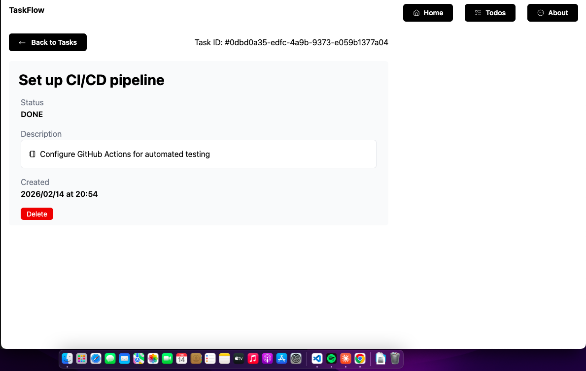
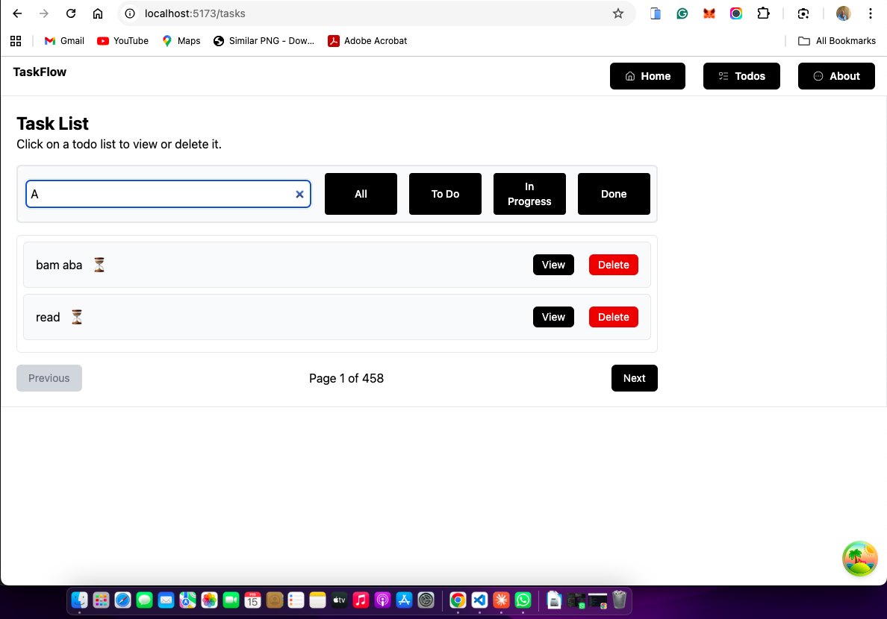
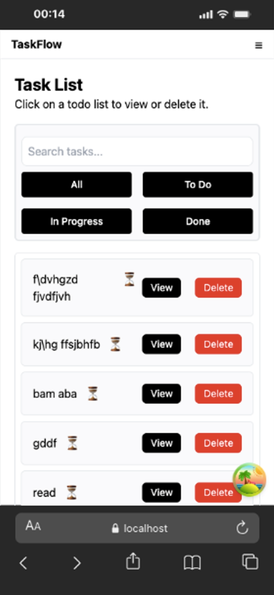
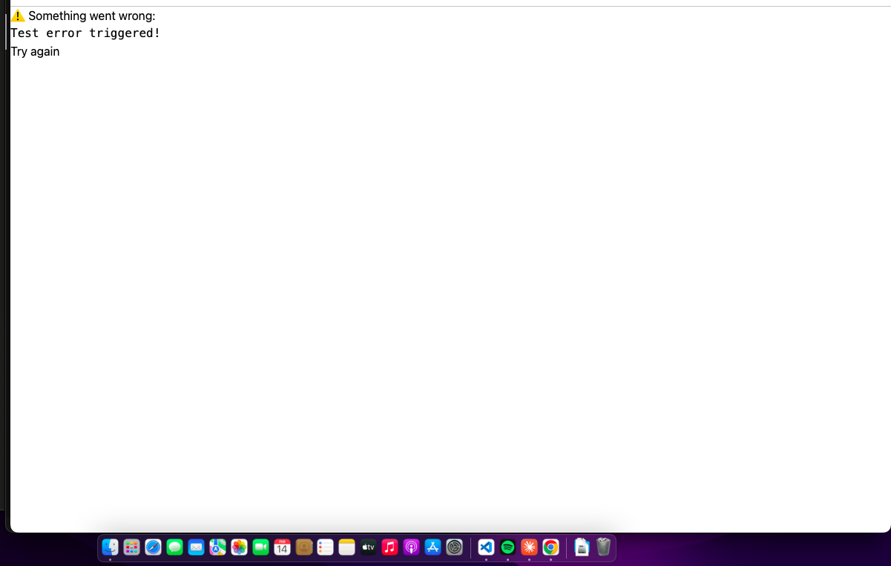

# TaskFlow

A modern, accessible task management application built with React 19 and designed to help users organize and track their daily tasks efficiently.

**Author:** Sotunde Emmanuel ([@Adefenwa](https://github.com/Adefenwa))

**Live Demo:** [Add deployment URL here]

**Repository:** [Add GitHub repository URL here]

---

## Project Description

TaskFlow is a feature-rich todo application that demonstrates modern React development practices and accessibility standards. The application provides a clean, intuitive interface for managing tasks with robust filtering, search capabilities, and comprehensive error handling.

Built as part of a frontend engineering assessment, TaskFlow showcases proficiency in React ecosystem tools, API integration, state management, and accessible web development.

---

## Features

### Core Features

- **Task List with Pagination**: Browse tasks with server-side pagination (10 items per page) and intuitive navigation controls
- **Task Detail View**: Dedicated pages for viewing comprehensive information about individual tasks
- **Search Functionality**: Real-time search to filter tasks by title/name
- **Status Filtering**: Filter tasks by completion status (All, To Do, In Progress, Done)
- **Error Handling**: Comprehensive error boundaries to gracefully handle runtime errors
- **Accessibility**: WCAG AA compliant with proper semantic HTML, ARIA attributes, and keyboard navigation support
- **Responsive Design**: Mobile-first design that works seamlessly across all device sizes
- **Loading States**: Proper loading indicators using React Suspense for improved user experience
- **404 Page**: Custom not found page for invalid routes

### Technical Features

- React 19 with functional components and hooks
- Suspense for data fetching and code splitting
- Error boundaries for error recovery
- React Router for client-side routing
- Tanstack Query for efficient data fetching and caching
- Lazy-loaded components for optimized performance
- Semantic HTML5 structure
- Accessible form controls and navigation

---

## Technology Stack

### Core Technologies

**React 19**

- Chosen for its component-based architecture, hooks ecosystem, and modern features like Suspense
- Enables building reusable, maintainable UI components
- Excellent developer experience with fast refresh and debugging tools

**React Router v6**

- Industry-standard routing solution for React applications
- Provides declarative routing with nested routes support
- Enables clean URL structure and browser history management

**Tanstack Query (React Query)**

- Powerful data synchronization library for React
- Automatic caching, background refetching, and request deduplication
- Simplifies complex async state management
- Built-in support for loading states, error handling, and optimistic updates
- Works seamlessly with React Suspense

**Tailwind CSS**

- Utility-first CSS framework for rapid UI development
- Ensures consistent design system across the application
- Mobile-first responsive design utilities
- Smaller bundle size compared to traditional CSS frameworks
- Easy to maintain and customize

### Supporting Libraries

**Lucide React**

- Modern, consistent icon set
- Tree-shakeable for optimal bundle size
- Accessible SVG icons

**React Hook Form**

- Performant form validation and handling
- Minimal re-renders for better performance
- Simple API with excellent TypeScript support

**React Error Boundary**

- Robust error handling solution
- Provides error recovery mechanisms
- Better user experience when errors occur

---

## Setup Instructions

### Prerequisites

- Node.js 18+ or Bun 1.0+
- npm, yarn, or bun package manager

### Installation

1. Clone the repository:

```bash
git clone [repository-url]
cd taskflow
```

2. Install dependencies:

```bash
# Using npm
npm install

# Using yarn
yarn install

# Using bun
bun install
```

3. Start the development server:

```bash
# Using npm
npm run dev

# Using yarn
yarn dev

# Using bun
bun run dev
```

4. Open your browser and navigate to:

```
http://localhost:5173
```

### Environment Setup

No environment variables are required for basic functionality. The application connects to the public API at `https://api.oluwasetemi.dev`.

---

## Available Scripts

### Development

```bash
npm run dev
```

Starts the development server with hot module replacement at `http://localhost:5173`

### Build

```bash
npm run build
```

Creates an optimized production build in the `dist` folder

### Preview

```bash
npm run preview
```

Previews the production build locally

### Lint

```bash
npm run lint
```

Runs ESLint to check code quality and adherence to coding standards

---

## Project Structure

```
taskflow/
├── public/              # Static assets
├── src/
│   ├── api/            # API client and endpoint functions
│   │   ├── client.js
│   │   └── tasks.js
│   ├── components/     # Reusable components
│   │   ├── TaskList.jsx
│   │   ├── Loading.jsx
│   │   └── ErrorFallback.jsx
│   ├── pages/          # Route pages
│   │   ├── HomePage.jsx
│   │   ├── TaskDetail.jsx
│   │   ├── ErrorPage.jsx
│   │   └── ErrorTest.jsx
│   ├── App.jsx         # Root component with routes
│   ├── main.jsx        # Application entry point
│   └── index.css       # Global styles
├── index.html
├── package.json
├── vite.config.js
└── README.md
```

---

## Key Features Implementation

### API Integration

The application integrates with a RESTful API using Tanstack Query for efficient data fetching:

- **Automatic Caching**: Reduces unnecessary API calls by caching responses
- **Background Refetching**: Keeps data fresh by refetching in the background
- **Optimistic Updates**: Provides instant feedback for better UX
- **Error Retry**: Automatically retries failed requests

### Pagination

Server-side pagination implementation:

- Fetches only the required data per page (10 items)
- Previous/Next navigation with disabled states at boundaries
- Page number display with total pages count
- Accessible navigation with proper ARIA labels

### Search and Filtering

Client-side filtering for instant results:

- Real-time search as you type
- Filter by task status (All, To Do, In Progress, Done)
- Combines search and filter criteria
- Accessible form controls with proper labels

### Accessibility Features

- Semantic HTML5 elements (main, nav, article, etc.)
- ARIA attributes for screen readers (aria-label, aria-live, role)
- Keyboard navigation support
- Focus management
- Color contrast compliance (WCAG AA)
- Alt text for images and icons
- Skip navigation links
- Descriptive link text

### Error Handling

Comprehensive error handling strategy:

- Error Boundary catches React component errors
- Query error states for API failures
- Custom 404 page for invalid routes
- Test route to demonstrate error boundary functionality
- User-friendly error messages
- Recovery options (retry, go back)

---

## Screenshots

### Task List Page



### Task Detail Page



### Search and Filter



### Responsive Design



### Error Handling



---

## Known Issues

None at this time.

The application has been thoroughly tested and is functioning as expected. All core features work correctly across different browsers and devices.

---

## Future Improvements

Given more development time, the following features would enhance the application:

### Planned Features

1. **Dark Mode Support**
   - Toggle between light and dark themes
   - Respect system preferences
   - Persistent theme selection

2. **Task Categories and Tags**
   - Organize tasks by categories
   - Add multiple tags per task
   - Filter by categories and tags
   - Color-coded organization

3. **Due Dates and Reminders**
   - Set due dates for tasks
   - Visual indicators for overdue tasks
   - Browser notifications for upcoming deadlines
   - Calendar view integration

4. **CRUD Operations**
   - Create new tasks directly in the app
   - Edit existing task details
   - Delete tasks with confirmation
   - Bulk operations (mark multiple as complete, delete, etc.)

5. **User Authentication**
   - User registration and login
   - Protected routes
   - User-specific task lists
   - Profile management

6. **Advanced Filtering**
   - Date range filtering
   - Priority-based filtering
   - Saved filter presets
   - Sort by multiple criteria

7. **Task Analytics**
   - Completion statistics
   - Productivity charts
   - Task history and trends
   - Export functionality

8. **Offline Support**
   - Progressive Web App (PWA) features
   - Offline data caching
   - Background sync when reconnected
   - Local storage backup

9. **Collaboration Features**
   - Share tasks with other users
   - Real-time updates via WebSocket
   - Task assignments
   - Comments and discussions

10. **Enhanced UI/UX**
    - Drag-and-drop task reordering
    - Keyboard shortcuts
    - Customizable themes
    - Animations and transitions

---

## Browser Support

- Chrome/Edge (latest 2 versions)
- Firefox (latest 2 versions)
- Safari (latest 2 versions)
- Mobile browsers (iOS Safari, Chrome Android)

---

## Performance Considerations

- Code splitting with React.lazy for optimal initial load
- Lazy loading of route components
- Efficient re-rendering with React Query caching
- Optimized bundle size with tree-shaking
- Memoization of expensive computations

---

## Accessibility Compliance

TaskFlow adheres to WCAG 2.1 Level AA standards:

- Keyboard navigation throughout the application
- Screen reader compatibility
- Sufficient color contrast ratios
- Semantic HTML structure
- ARIA labels and landmarks
- Focus indicators
- Error identification and suggestions

---

## License

This project is developed as part of a frontend engineering assessment.

---

## Acknowledgments

- API provided by [https://api.oluwasetemi.dev](https://api.oluwasetemi.dev)
- Icons by Lucide React
- Built with Vite for optimal development experience

---

## Contact

**Sotunde Emmanuel**

- GitHub: [@Adefenwa](https://github.com/Adefenwa)
- Email: [Add your email here]

For questions, feedback, or contributions, please open an issue in the repository.
